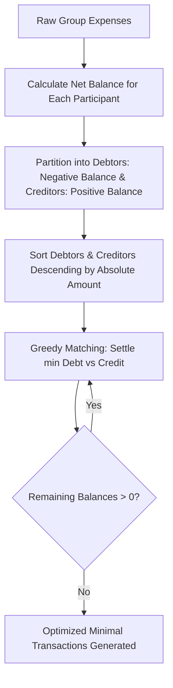

# 🎓 Campus Expense Split (Campus QuickSplit)

[](https://flutter.dev)
[](https://dart.dev)
[](https://firebase.google.com)
[](https://pub.dev/packages/hive)
[](LICENSE)

An intelligent, collaborative expense sharing and debt simplification mobile application tailored for college students, roommates, event organizers, and campus project teams. **Campus Expense Split** eliminates awkward money conversations by automating bill splitting, tracking group contributions, visualizing spending habits, and optimizing debt settlements with minimal peer transactions.

---

## 🌟 Key Features

### 👥 1. Group Collaboration & Room Codes
- **Instant Group Creation:** Create custom groups with 6-character room codes.
- **Dynamic Search & Join:** Search and join existing groups dynamically as you type.
- **Multi-Member Management:** Select and manage members with interactive chips and owner designations.

### 💰 2. Multi-Mode Expense Splitting & Multi-Payer Breakdown
- **Uniform Split (Equal):** Divides the total bill equally among all group participants.
- **Specific Split (Exact Amounts):** Assign precise customized amounts to individual members.
- **Ratio Split (Weighted / Percentage):** Split based on custom percentages or weights (e.g., room size, consumption).
- **Multiple Payer Support:** Log expenses paid collaboratively by more than one person in custom proportions.
- **Category Tagging:** Organize spending across categories like *Movie, Food & Dining, Utilities, Travel, Printouts, Subscriptions, and Others*.

### ⚡ 3. Debt Simplification & Settlement Optimization
- **Greedy Cashflow Algorithm:** Transforms messy, multi-party debt webs into the minimum possible number of direct repayment transactions.
- **Personal Repayment Path:** Filter settlements to see only transactions involving your account.
- **Simulated Payment Gateway:** Settle dues with an in-app simulated payment flow that updates ledger balances in real-time.

### 📊 4. Visual Analytics & Insights
- **Interactive Pie Charts:** Visual category-wise spending distribution rendered with custom painters.
- **Monthly Spending Trends:** Track month-over-month expenditure with progress bars.
- **Contribution Comparison:** Side-by-side comparison of individual contribution vs. total group expenditure.

### 📑 5. Expense Summary & Balances
- **Personal Overview:** High-level metrics for **Total Spent**, **You Owe**, and **Owed to You**.
- **Group Drilldown:** Expandable cards displaying each member's contributions, fair share, and live net balance status (*"Gets back \$X"*, *"Owes \$Y"*, or *"Settled up"*).

### 🔄 6. Offline-First & Realtime Cloud Sync
- **Local Hive Caching:** Rapid offline caching using [Hive](https://pub.dev/packages/hive) for instant UI feedback even with poor campus Wi-Fi.
- **Cloud Firestore Sync:** Real-time bi-directional sync across all group members using Firebase Firestore streams.

### 🗑️ 7. Expense History with Undo
- **Swipe-to-Delete:** Dismissible expense items for fast removal from Firestore and local cache.
- **Undo Restoration:** Temporary SnackBar action to restore accidentally deleted expenses with a single tap.

### 🌓 8. Material 3 Theming & Dark Mode
- Seamless light and dark mode toggling persisted across sessions.
- Modern Material 3 UI with deep purple accent palettes and custom typography.

---

## 📐 Architecture & Debt Simplification Workflow

Campus Expense Split employs a **Greedy Debt Minimization Algorithm** to eliminate redundant cyclic transactions:



---

## 🛠️ Tech Stack

| Layer | Technologies |
|---|---|
| **Frontend Framework** | [Flutter](https://flutter.dev) (v3.x), [Dart](https://dart.dev) (v3.13+) |
| **State Management** | [Provider](https://pub.dev/packages/provider) |
| **Backend & Cloud Database** | [Firebase Authentication](https://firebase.google.com/products/auth), [Cloud Firestore](https://firebase.google.com/products/firestore) |
| **Local Storage / Cache** | [Hive](https://pub.dev/packages/hive), [Hive Flutter](https://pub.dev/packages/hive_flutter), [Shared Preferences](https://pub.dev/packages/shared_preferences) |
| **UI & Visuals** | Material 3, [Google Fonts](https://pub.dev/packages/google_fonts) (`NotoSans`), [FL Chart](https://pub.dev/packages/fl_chart), Custom Painters |
| **Utilities** | [Intl](https://pub.dev/packages/intl), [Path Provider](https://pub.dev/packages/path_provider) |

---

## 📁 Project Directory Structure

```text
campusexpensesplit/
├── android/                        # Android platform configuration & Gradle scripts
├── ios/                            # iOS platform configuration
├── web/                            # Web platform support
├── assets/                         # Static assets (fonts, icons, images)
│   └── fonts/
├── lib/
│   ├── main.dart                   # Entry point, Firebase & Hive init, ThemeData configuration
│   ├── firebase_options.dart       # Firebase platform configuration mappings
│   ├── models.dart                 # Core data models (Expense, Participant, Settlement, Enums)
│   ├── provider.dart               # ExpenseProvider (centralized state management & Hive sync)
│   ├── services/
│   │   └── debt_simplification_service.dart  # Debt minimization algorithm
│   └── screens/
│       ├── login_screen.dart                 # Email & password authentication / registration
│       ├── landing_screen.dart               # Main navigation menu hub
│       ├── add_expense_screen.dart           # Expense creation, group join/create, split modes
│       ├── expense_summary_screen.dart       # Personal and group balance breakdown tabs
│       ├── analytics_screen.dart             # Pie charts, monthly trends, and spending insights
│       ├── expense_history_screen.dart       # Chronological ledger with swipe-to-delete & undo
│       └── settlement_optimization_screen.dart# Minimal transaction solver with payment simulation
├── pubspec.yaml                    # Package dependencies and asset configurations
└── README.md                       # Project documentation
```

---

## 🚀 Getting Started

### Prerequisites
Before running the application, ensure you have:
- [Flutter SDK](https://docs.flutter.dev/get-started/install) (version `3.13.0` or later)
- [Dart SDK](https://dart.dev/get-dart)
- Android Studio / Xcode / VS Code with Flutter extensions
- A Firebase project configured with Authentication & Cloud Firestore

---

### Installation & Setup

1. **Clone the Repository:**
   ```bash
   git clone https://github.com/ananya290208/campusexpensesplit.git
   cd campusexpensesplit
   ```

2. **Install Dependencies:**
   ```bash
   flutter pub get
   ```

3. **Configure Firebase:**
   - Create a project on the [Firebase Console](https://console.firebase.google.com/).
   - Enable **Firebase Authentication** (Email/Password & Anonymous sign-in methods).
   - Enable **Cloud Firestore** in test or production mode.
   - For Android, place your `google-services.json` inside `android/app/`.
   - Alternatively, configure via FlutterFire CLI:
     ```bash
     flutterfire configure
     ```

4. **Run the App:**
   ```bash
   flutter run
   ```

---

## 💡 How Split Modes Work

| Mode | Use Case | Example Calculation |
|---|---|---|
| **Uniform** | Everyone consumes equally (e.g., shared Wi-Fi, pizza). | Total: \$60, 3 Members &rarr; \$20 / person |
| **Specific** | Each person ordered different items (e.g., restaurant bill). | Total: \$50 &rarr; User A: \$20, User B: \$18, User C: \$12 |
| **Ratio** | Proportional splitting based on usage or room dimensions. | Total: \$100, Ratio (50%:30%:20%) &rarr; \$50, \$30, \$20 |

---

## 🔒 Firestore Security Rules (Recommended)

To ensure secure and efficient reads/writes in production, configure the following rules in your Firebase Console:

```javascript
rules_version = '2';
service cloud.firestore {
  match /databases/{database}/documents {
    match /users/{userId} {
      allow read, write: if request.auth != null;
    }
    match /groups/{groupId} {
      allow read, write: if request.auth != null;
      match /participants/{participantId} {
        allow read, write: if request.auth != null;
      }
      match /expenses/{expenseId} {
        allow read, write: if request.auth != null;
      }
    }
    match /expenses/{expenseId} {
      allow read, write: if request.auth != null;
    }
  }
}
```

---

## 🤝 Contributing

Contributions are welcome! If you'd like to improve Campus Expense Split:

1. Fork the project repository.
2. Create your feature branch:
   ```bash
   git checkout -b feature/AmazingFeature
   ```
3. Commit your changes:
   ```bash
   git commit -m "Add some AmazingFeature"
   ```
4. Push to the branch:
   ```bash
   git push origin feature/AmazingFeature
   ```
5. Open a Pull Request.

---

## 📄 License

This project is licensed under the MIT License - see the [LICENSE](LICENSE) file for details.

---

<p align="center">Made with ❤️ for students everywhere</p>
